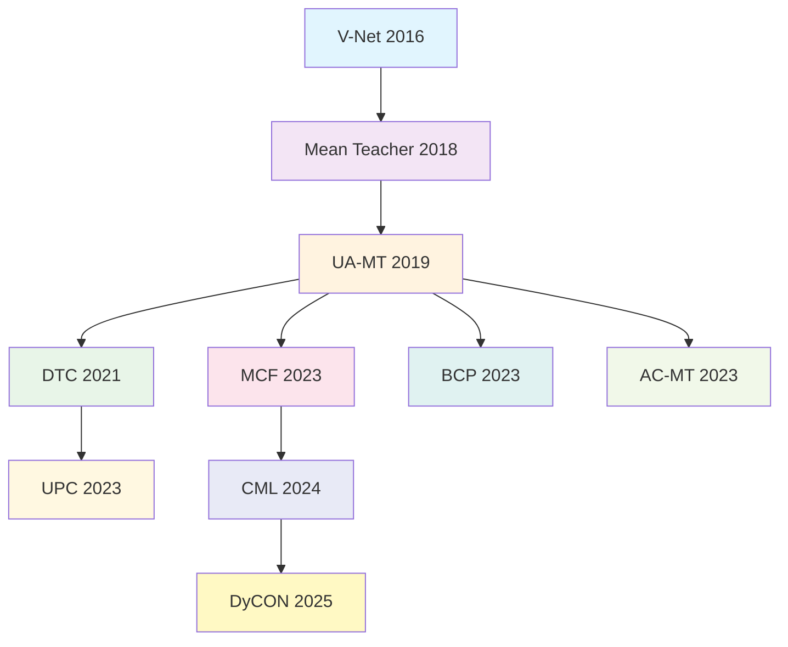

# 半监督医学图像分割方法合集

## 📖 研究方向介绍

**半监督医学图像分割（Semi-supervised Medical Image Segmentation）** 是一个重要且活跃的研究领域，主要解决医学图像分割中标注数据稀缺的问题。

### 🎯 研究背景

深度神经网络为自动化医学图像分割提供了最先进的性能，但训练这些模型需要专家进行昂贵的标注工作。由于难以获得大量标注数据，半监督学习正成为医学图像分割的一个有吸引力的解决方案。

### 🔧 核心技术框架

这些方法主要基于以下几种核心技术：

- **Mean Teacher (MT) 架构**：师生框架，教师模型通过指数移动平均(EMA)更新参数，指导学生模型学习
- **一致性正则化**：在未标注数据上施加数据级和模型级一致性，强制模型在不同扰动下产生一致的预测
- **不确定性引导**：将不确定性图融入模型中，强制学生从教师模型的高置信度预测中学习

### 🏥 应用场景

这些方法已被应用于多种医学图像分割任务，如心脏磁共振成像、前列腺分割、脑肿瘤分割等，在各种医学数据集上展现出良好的性能。

------

## 📚 论文方法概览

| 方法                                                         | 发表年份 | 会议/期刊 | 核心创新                         | GitHub链接                                                 |
| ------------------------------------------------------------ | -------- | --------- | -------------------------------- | ---------------------------------------------------------- |
| [Mean Teacher](https://arxiv.org/abs/1703.01780)             | 2018     | NIPS      | 权重平均替代标签预测平均         | [GitHub](https://github.com/shunk031/chainer-MeanTeachers) |
| [UA-MT](https://arxiv.org/abs/1907.07034)                    | 2019     | MICCAI    | 不确定性引导的Mean Teacher       | [GitHub](https://github.com/yulequan/UA-MT)                |
| [DTC](https://ojs.aaai.org/index.php/AAAI/article/view/17066) | 2021     | AAAI      | 双任务一致性学习                 | [GitHub](https://github.com/HiLab-git/DTC)                 |
| [UPC](https://www.sciencedirect.com/science/article/pii/S1746809422006577) | 2023     | CBM       | 不确定性感知伪标签与一致性       | [GitHub](https://github.com/AIforMS/UPC-Pytorch)           |
| [MCF](https://openaccess.thecvf.com/content/CVPR2023/papers/Wang_MCF_Mutual_Correction_Framework_for_Semi-Supervised_Medical_Image_Segmentation_CVPR_2023_paper.pdf) | 2023     | CVPR      | 互校正框架解决认知偏见           | [GitHub](https://github.com/WYC-321/MCF)                   |
| [BCP](https://arxiv.org/pdf/2305.00673)                      | 2023     | CVPR      | 双向copy-paste数据增强           | [GitHub](https://github.com/DeepMed-Lab-ECNU/BCP)          |
| [CML](https://openreview.net/pdf/98a9ec17dea3e4d96eb45416cca53a8364aa93b1.pdf) | 2024     | ACM MM    | 跨视角互补学习                   | [GitHub](https://github.com/SongwuJob/CML)                 |
| [AC-MT](https://www.sciencedirect.com/science/article/pii/S1361841523001408) | 2023     | MedIA     | 模糊共识均值教师                 | [GitHub](https://github.com/lemoshu/AC-MT)                 |
| [DyCON](https://arxiv.org/pdf/2504.04566)                    | 2025     | CVPR      | 动态不确定性感知一致性与对比学习 | [GitHub](https://github.com/KU-CVML/DyCON)                 |
| [V-Net](https://arxiv.org/abs/1606.04797)                    | 2016     | 3DV       | 3D医学图像分割基础网络           | [GitHub](https://github.com/mattmacy/vnet.pytorch)         |

------

## 📋 详细方法介绍

### Mean Teacher (MT)

> **论文链接**: [Mean teachers are better role models](https://arxiv.org/abs/1703.01780)
>
> **GitHub仓库链接**: [MT](https://github.com/shunk031/chainer-MeanTeachers)  
>
>  **发表年份**: 2018 NIPS

#### 核心创新

Mean Teacher方法用模型权重平均替代标签预测平均，解决了Temporal Ensembling的局限性：

- **学生模型**：正常的训练网络，接受梯度更新
- **教师模型**：使用学生模型权重的指数移动平均(EMA)
- 两个模型都对输入应用不同的噪声扰动

#### 技术细节

- **EMA更新**：`θ'_t = αθ'_{t-1} + (1-α)θ_t`
- **一致性损失**：`J(θ) = E[||f(x,θ',η') - f(x,θ,η)||²]`
- 使用均方误差(MSE)作为一致性损失函数

#### 实验结果

- **SVHN数据集**：250标签下达到4.35%错误率
- **CIFAR-10数据集**：4000标签下从10.55%提升到6.28%
- **ImageNet数据集**：10%标签下从35.24%提升到9.11%

------

### UA-MT (Uncertainty-Aware Mean Teacher)

> **论文链接**: [Uncertainty aware multi-view co-training for semi-supervised medical image segmentation](https://arxiv.org/abs/1907.07034)
>
> **GitHub仓库链接**: [UA-MT](https://github.com/yulequan/UA-MT)  
>
>  **发表年份**: 2019 MICCAI

#### 核心创新

在Mean Teacher基础上引入**不确定性引导机制**，只对高置信度的预测计算一致性损失：

- 使用**Monte Carlo Dropout**进行不确定性估计
- 预测熵作为不确定性度量：`u = -Σc μc log μc`
- 动态阈值调度策略，从确定案例逐步学习到不确定案例

#### 关键技术

```python
# 不确定性引导的一致性损失
Lc = [Σv I(uv < H) ||f'v - fv||²] / [Σv I(uv < H)]
```

#### 实验结果

**左心房分割数据集（16标注+64未标注）**：

- Dice: 88.88%，Jaccard: 80.21%
- 相比监督方法显著提升，接近完全监督性能

------

### DTC (Dual-Task Consistency)

> **论文链接**: [Deep Transform Consistency for Semi-supervised Medical Image Segmentation](https://ojs.aaai.org/index.php/AAAI/article/view/17066)
>
> **GitHub仓库链接**: [DTC](https://github.com/HiLab-git/DTC)  
>
>  **发表年份**: 2021 AAAI

#### 核心创新

构建**任务级正则化**，在像素级分类任务和几何感知水平集回归任务之间建立一致性约束：

- **任务1**：传统像素级分割
- **任务2**：水平集函数回归（捕获几何和距离信息）
- 使用可微任务变换层连接两个任务

#### 技术特点

- 效率高：无需多次前向传播
- 参数少：相比复杂多网络架构，参数量更少
- 通用性强：可扩展到其他任务组合

#### 实验结果

**胰腺分割（12标注+50未标注）**：

- Dice: 78.27%，Jaccard: 64.75%
- 训练时间仅2.5小时，显著快于其他方法

------

### UPC (Uncertainty-aware Pseudo-label and Consistency)

> **论文链接**: [Uncertainty-aware Pseudo-label and Consistency for Semi-supervised Medical Image Segmentation](https://www.sciencedirect.com/science/article/pii/S1746809422006577)
>
> **GitHub仓库链接**: [UPC](https://github.com/AIforMS/UPC-Pytorch)  
>
>  **发表年份**: 2023 CBM

#### 核心创新

首次在医学图像分割中有效结合**一致性正则化**与**伪标签学习**：

- 使用KL散度作为不确定性度量
- 动态不确定性机制，避免固定阈值的局限性
- 端到端训练框架

#### 技术优势

- 计算高效：相比Monte Carlo Dropout方法，训练时间从3.14h降至1.27h
- 适应性强：动态阈值机制适应不同预测质量
- 性能优异：在标注数据稀缺场景下表现突出

#### 实验结果

**左心房分割数据集**：

- Dice: 89.65%，95HD: 6.71 voxel
- 在极少标注数据（4标注+76未标注）下Dice仍达84.37%

------

### MCF (Mutual Correction Framework)

> **论文链接**: [MCF: Mutual Correction Framework for Semi-Supervised Medical Image Segmentation](https://openaccess.thecvf.com/content/CVPR2023/papers/Wang_MCF_Mutual_Correction_Framework_for_Semi-Supervised_Medical_Image_Segmentation_CVPR_2023_paper.pdf)
>
> **GitHub仓库链接**: [MCF](https://github.com/WYC-321/MCF)  
>
>  **发表年份**: 2023 CVPR

#### 核心创新

专门解决半监督学习中的**模型认知偏见**问题：

- **异构子网络设计**：VNet + 3D-ResVNet，结构不同、参数独立
- **对比差异审查(CDR)**：利用XOR操作找出不一致区域并修正
- **动态竞争伪标签生成(DCPLG)**：实时评估性能，动态选择最佳伪标签生成器

#### 技术亮点

```python
# 对比差异审查
M_diff = BINA(Ŷ^L_A) ⊕ BINA(Ŷ^L_B)  # XOR操作
L_rec = MSE(Ŷ^L_diff, Y^L_diff)       # 修正损失
```

#### 实验结果

**左心房分割数据集**：

- Dice: 88.71%，95HD: 6.32 voxel
- CDR模块可作为"免费午餐"集成到其他方法中

------

### BCP (Bidirectional Copy-Paste)

> **论文链接**: [Bidirectional Copy-Paste for Semi-Supervised Medical Image Segmentation](https://arxiv.org/pdf/2305.00673)
>
> **GitHub仓库链接**: [BCP](https://github.com/DeepMed-Lab-ECNU/BCP)  
>
>  **发表年份**: 2023 CVPR

#### 核心创新

解决标注数据与未标注数据间的**经验分布不匹配**问题：

- **双向混合策略**：内向混合（未标注前景+标注背景）+ 外向混合（标注前景+未标注背景）
- **零中心掩码设计**：前景背景交互充分，语义保持效果最佳
- **三阶段训练**：预训练→初始化→自训练

#### 技术优势

- 分布对齐：有效缓解标注与未标注数据的分布不匹配
- 简单高效：无需额外参数，计算开销与基线相同
- 广泛适用：在不同模态、不同器官分割任务上均有效

#### 实验结果

**心脏分割(ACDC数据集，5%标注)**：

- Dice: 87.59%，相比基线提升21.76%
- 在极少标注数据下展现显著优势

------

### CML (Cross-View Mutual Learning)

> **论文链接**: [Cross-View Mutual Learning for Semi-Supervised Medical Image Segmentation](https://openreview.net/pdf/98a9ec17dea3e4d96eb45416cca53a8364aa93b1.pdf)
>
> **GitHub仓库链接**: [CML](https://github.com/SongwuJob/CML)  
>
>  **发表年份**: 2024 ACM MM

#### 核心创新

从"一致性学习"转向"一致性+互补性"的协同学习：

- **冲突特征学习(CFL)**：鼓励两个子网络从同一输入学习不同特征
- **跨视角互学习**：通过CutMix构建异构监督信号
- **异构监督信号**：混合自身视角和对方视角的伪标签

#### 技术核心

```python
# 冲突特征学习
L_dis = 1 + (f_i · f̄_(1-i))/(||f_i|| × ||f̄_(1-i)||)
```

#### 实验结果

**左心房分割数据集（10%标注）**：

- Dice: 90.36%，95HD: 6.06 voxel
- 在三个不同模态数据集上均取得SOTA结果

------

### AC-MT (Ambiguity-Consensus Mean Teacher)

> **论文链接**: [AC-MT: Ambiguity-Consensus Mean Teacher](https://www.sciencedirect.com/science/article/pii/S1361841523001408)
>
> **GitHub仓库链接**: [AC-MT](https://github.com/lemoshu/AC-MT)  
>
>  **发表年份**: 2023 Medical Image Analysis

#### 核心创新

专注于**模糊但信息丰富的区域**进行一致性学习：

- **四种模糊目标选择策略**：高Softmax熵、高模型不确定性、原型引导标签噪声识别、类条件系统性标签噪声识别
- **自适应目标选择**：动态识别模糊但信息丰富的体素
- **即插即用设计**：无需修改骨干网络或引入额外参数

#### 实验结果

**左心房分割（10%标注数据）**：

- Dice系数提升5.8%（84.25% → 89.12%）
- 在极端稀缺标注（2.5%）下仍达81.18% Dice

------

### DyCON (Dynamic Uncertainty-aware Consistency)

> **论文链接**: [Dynamic Uncertainty-aware Consistency and Contrastive Learning](https://arxiv.org/pdf/2504.04566)
>
> **GitHub仓库链接**: [DyCON](https://github.com/KU-CVML/DyCON)  
>
>  **发表年份**: 2025

#### 核心创新

处理类别不平衡和病理变化引起的高不确定性：

- **不确定性感知一致性损失(UnCL)**：动态调整体素贡献，保留高不确定性区域信息
- **焦点熵感知对比损失(FeCL)**：双重焦点机制处理类别不平衡
- **自适应β策略**：根据训练进度动态调整不确定性处理

#### 技术亮点

```python
# 不确定性感知一致性损失
L_UnCL = (1/N) Σ [L(p^s_i, p^t_i) / (exp(β·H_s) + exp(β·H_t))] + (β/N) Σ [H_s + H_t]
```

#### 实验结果

**ISLES-2022数据集（5%标注）**：

- Dice: 61.48%，HD95: 17.61 voxel
- 在中风病变等高挑战性任务上表现优异

------

### V-Net

> **论文链接**: [V-Net: Fully Convolutional Neural Networks for Volumetric Medical Image Segmentation](https://arxiv.org/abs/1606.04797)
>
> **GitHub仓库链接**: [V-Net](https://github.com/mattmacy/vnet.pytorch)  
>
>  **发表年份**: 2016 3DV

#### 核心创新

首个用于3D医学图像分割的端到端全卷积神经网络：

- **3D体积卷积**：直接处理3D体积数据，保持空间连续性
- **残差学习架构**：每个阶段学习残差函数，加速收敛
- **Dice损失函数**：自动处理类别不平衡，直接优化分割质量指标
- **V型架构**：编码器-解码器结构，包含跳跃连接

#### 技术意义

- 确立了医学图像分割的U型架构范式
- Dice损失成为医学分割标准
- 为后续3D分割网络奠定基础

#### 实验结果

**PROMISE2012前列腺分割**：

- Dice: 0.869±0.033，Hausdorff距离: 5.71±1.20 mm
- 处理速度约1秒/体积，远快于传统方法

------

## 🔍 方法对比与分析

### 性能对比表

**左心房分割数据集（标准对比设置）**

| 方法         | 标注数据 | Dice (%) | Jaccard (%) | 95HD (voxel) | ASD (voxel) |
| ------------ | -------- | -------- | ----------- | ------------ | ----------- |
| V-Net (监督) | 16       | 85.06    | 74.54       | 17.38        | 4.54        |
| MT           | 16+64    | 85.89    | 76.58       | 12.63        | 3.44        |
| UA-MT        | 16+64    | 88.88    | 80.21       | 7.32         | 2.26        |
| DTC          | 16+64    | 89.42    | 80.98       | 7.32         | 2.10        |
| UPC          | 16+64    | 89.65    | 81.36       | 6.71         | 2.15        |
| MCF          | 16+64    | 88.71    | 80.41       | 6.32         | 1.90        |
| CML          | 16+64    | 90.36    | -           | 6.06         | 1.68        |
| AC-MT        | 16+64    | 89.12    | 80.46       | -            | -           |

### 技术演进脉络



### 方法分类

#### 🎯 按核心技术分类

**一致性正则化类**：

- Mean Teacher, UA-MT, AC-MT, DyCON

**多任务学习类**：

- DTC

**伪标签结合类**：

- UPC

**多模型协同类**：

- MCF, CML

**数据增强驱动类**：

- BCP

#### 🏆 按创新点分类

**不确定性处理**：

- UA-MT (过滤), UPC (动态), AC-MT (模糊区域), DyCON (保留+利用)

**认知偏见解决**：

- MCF (异构网络), CML (互补学习)

**分布不匹配**：

- BCP (双向copy-paste)

**任务级约束**：

- DTC (水平集回归)

------

## 📊 应用数据集

### 常用数据集介绍

| 数据集               | 模态 | 任务         | 样本数       | 特点                  |
| -------------------- | ---- | ------------ | ------------ | --------------------- |
| **LA (Left Atrium)** | MRI  | 左心房分割   | 100个3D扫描  | MICCAI 2018挑战赛数据 |
| **ACDC**             | MRI  | 心脏分割     | 150个患者    | 多类别心脏结构分割    |
| **BraTS-2019**       | MRI  | 脑肿瘤分割   | 335个患者    | 多模态脑肿瘤分割      |
| **Pancreas-NIH**     | CT   | 胰腺分割     | 82个CT扫描   | 挑战性小器官分割      |
| **PROMISE2012**      | MRI  | 前列腺分割   | 50个训练样本 | V-Net原始验证数据集   |
| **ISLES-2022**       | MRI  | 中风病变分割 | -            | 高类别不平衡场景      |

------

## 🚀 使用建议

### 方法选择指南

**基础入门**：

- 从**Mean Teacher**开始，理解师生框架基本原理
- 使用**V-Net**作为骨干网络进行3D医学图像分割

**不确定性处理**：

- **标注数据充足**：选择UA-MT
- **标注数据稀缺**：选择AC-MT
- **极端类别不平衡**：选择DyCON

**性能优化**：

- **需要最佳性能**：尝试CML
- **计算资源有限**：选择UPC
- **特定任务适配**：考虑DTC

**实际部署**：

- **稳定性优先**：MCF (认知偏见纠正)
- **数据增强需求**：BCP
- **多模态数据**：DyCON

### 实现建议

1. **环境配置**：大部分方法基于PyTorch实现，需要CUDA支持
2. **数据预处理**：统一数据格式，注意归一化和增强策略
3. **超参数调优**：从论文推荐参数开始，根据具体数据集微调
4. **评估指标**：使用Dice系数、Jaccard指数、Hausdorff距离等标准指标
5. **训练策略**：注意EMA更新、学习率调度、一致性权重等关键参数

------

## 📖 引用格式

如果这些方法对您的研究有帮助，请考虑引用相关论文：

```bibtex
@inproceedings{tarvainen2017mean,
  title={Mean teachers are better role models: Weight-averaged consistency targets improve semi-supervised deep learning results},
  author={Tarvainen, Antti and Valpola, Harri},
  booktitle={NIPS},
  year={2017}
}

@inproceedings{yu2019uncertainty,
  title={Uncertainty-aware self-ensembling model for semi-supervised 3D left atrium segmentation},
  author={Yu, Lequan and Wang, Shujun and Li, Xiaomeng and Fu, Chi-Wing and Heng, Pheng-Ann},
  booktitle={MICCAI},
  year={2019}
}

@inproceedings{luo2021semi,
  title={Semi-supervised medical image segmentation through dual-task consistency},
  author={Luo, Xiangde and Chen, Jieneng and Song, Tao and Wang, Guotai},
  booktitle={AAAI},
  year={2021}
}

# ... 其他引用格式
```

------

## 💡 未来发展方向

### 技术趋势

1. **多模态融合**：结合不同成像模态的互补信息
2. **轻量化设计**：降低计算复杂度，适应临床部署
3. **可解释性增强**：提高模型决策的可解释性
4. **领域自适应**：跨数据集、跨设备的泛化能力
5. **主动学习结合**：智能选择最有价值的样本进行标注

### 应用扩展

- **实时分割**：手术导航和实时诊断
- **多器官联合分割**：全身器官同时分割
- **时序数据处理**：4D医学图像分析
- **跨模态分割**：不同成像技术间的知识迁移

------

## 🤝 贡献指南

欢迎为这个仓库贡献新的方法、改进建议或bug修复！

### 贡献方式

1. **Fork** 本仓库
2. 创建您的特性分支 (`git checkout -b feature/AmazingFeature`)
3. 提交您的更改 (`git commit -m 'Add some AmazingFeature'`)
4. 推送到分支 (`git push origin feature/AmazingFeature`)
5. 打开一个 **Pull Request**

### 新方法添加格式

请按照以下格式添加新方法：

```markdown
### 方法名称

> **论文链接**: [标题](链接)  
> **GitHub仓库链接**: [标题](链接)  
> **发表年份**: 年份 会议/期刊

#### 核心创新
- 主要技术创新点

#### 实验结果
- 关键性能数据

```

------

## 📄 许可证

本项目采用 MIT 许可证 - 查看 [LICENSE]() 文件了解详情。

------

## 📞 联系方式

如有任何问题或建议，请通过以下方式联系：

- 📧 Email: [您的邮箱](zihao3351@gmail.com)
- 🐛 Issues: [GitHub Issues](https://github.com/unumbrela/Semi-Supervised-Medical-Segmentation-Collection/issues)

------

**⭐ 如果这个仓库对您有帮助，请给个Star支持一下！**